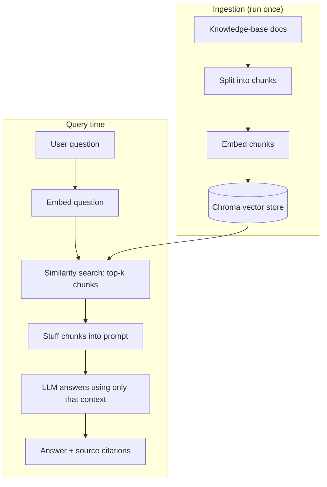

<div align="center">

# 🔎 RAG Knowledge Worker

**Ask natural-language questions over a document knowledge base — answered with retrieval-augmented generation and source citations.**

[](https://www.python.org/)
[](https://www.langchain.com/)
[](https://www.trychroma.com/)
[](https://platform.openai.com/)
[](https://www.gradio.app/)
[](LICENSE)

</div>

---

## 🧠 What it is
A **Retrieval-Augmented Generation (RAG)** assistant that answers questions grounded in a
set of documents (here: a sample fintech company knowledge base). Instead of relying on
the model's training memory, it **retrieves the most relevant chunks** from a vector
database and asks the LLM to answer **using only those chunks** — keeping answers accurate,
current, and cited. If the answer isn't in the documents, it says so instead of guessing.

## 🏗️ Architecture



## 🔄 How it works
1. **Ingest** (`ingest.py`) — load the markdown docs, split them into overlapping chunks,
   embed each chunk with OpenAI embeddings, and persist the vectors to a local Chroma store.
2. **Retrieve + answer** (`rag.py`) — embed the question, run a similarity search for the
   top-`k` chunks, inject them into the system prompt, and have the LLM answer strictly
   from that context (returning which source files it used).
3. **Serve** (`app.py`) — a Gradio chat UI over the pipeline, with example prompts and
   inline source citations.

## ✨ Features
- 📚 **Grounded answers** with **source-file citations**
- 🛡️ **Refuses to hallucinate** — says "I don't know" when the docs don't cover it
- 🔧 **Configurable** chunk size, overlap, retriever `k`, and models (see `config.py`)
- 🔁 **Re-runnable ingestion** — rebuilds the store cleanly when docs change
- 💸 Uses `text-embedding-3-small` + `gpt-4o-mini` — cheap to run

## 🧰 Tech stack
**Python · LangChain · ChromaDB · OpenAI (embeddings + chat) · Gradio**

## 📂 Project structure
```
rag-knowledge-worker/
├── config.py         # models, paths, chunking + retrieval settings
├── ingest.py         # load → split → embed → persist to Chroma
├── rag.py            # retrieve top-k chunks → answer grounded in them
├── app.py            # Gradio chat UI
├── knowledge-base/   # the source documents (sample fintech company)
└── requirements.txt
```

## ⚡ Run it yourself
```bash
cp .env.example .env         # set OPENAI_API_KEY
pip install -r requirements.txt
python ingest.py             # build the vector store
python app.py                # http://localhost:7860
```

## 💬 Try asking
- *"What certifications does Aurora have?"*
- *"How long does onboarding take?"*
- *"What's the uptime SLA for enterprise customers?"*
- *"Which systems can Aurora integrate with?"*

## 🔑 Key RAG concepts demonstrated
- **Chunking & overlap** — balancing retrieval granularity against context coherence
- **Embeddings & vector similarity search** — semantic retrieval, not keyword matching
- **Context grounding** — the prompt pattern that keeps answers factual and cited
- **Hallucination control** — instructing the model to defer when context is insufficient

---
<div align="center"><sub>Part of my AI/LLM engineering portfolio — a Backend + AI journey.</sub></div>
